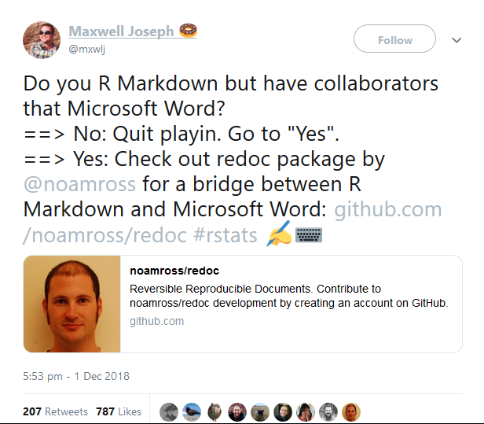

```{r setup, include=FALSE}
options(htmltools.dir.version = FALSE)
```

# Introduction: The Problem Scenario

- You are working on a collaborative project within a multidisciplinary team.


- You have produced analyses in `R` and written up a document using `RMarkdown`.


- You choose to output to MS Word and share the document.

--

- A collaborator tells you your work is rubbish and returns the document full of tracked changes and comments.

--

- You need to make revisions but tracked changes and comments cannot be pulled into `RMarkdown`.

---

class: inverse, middle, center




---
class: inverse, middle, center

# Example: nps_report_20161216.docx

---

# redoc

- [`redoc`](https://noamross.github.io/redoc) is an experimental package created by Noam Ross to enable a two-way `RMarkdown` ⟷ Microsoft Word workflow.

- **Package is in the very early stages and still buggy. It needs a lot of work** (if interested, you can [contribute](https://github.com/noamross/redoc/blob/master/.github/CONTRIBUTING.md)).

- Uses [lua filters](https://pandoc.org/lua-filters.html) so **needs Pandoc v2 (comes with RStudio 1.2)**

--

Install with

```{r eval=FALSE, tidy=FALSE}
source("https://install-github.me/noamross/redoc")
```

- Provides new output format: `rdocx_reversible()`.

```yaml
---
output:
  redoc::rdocx_reversible:
    keep_md: TRUE
    highlight_outputs: TRUE
---
```

--

- Word files created with `redoc` can be reverted back to `.Rmd`, even if they have been edited.

- Tracked changes and comments added using [Critic Markup](http://criticmarkup.com/spec.php#thebasicsyntax).

- **VERY COOL** but quite complex behind the scenes.

---
# Critic Markup: The 5 Types

--

.pull-left[
**Addition** 

<font color="green">`{++ ++}`

`{++added in words appear here++}`</font>

**Deletion**

<font color="red">`{-- --}`

`{--deleted words appear here--}`</font>

**Substitution**

<font color="orange">`{~~ ~> ~~}`

`{~~sabstatute~>substitute~~}`</font>
]

--

.pull-left[
**Comment**

<font color="blue">`{>> <<}`

`{>>This is terrible!<<}`</font>

**Highlight (for comments)**

<font color="purple">`{== ==}`</font><font color="blue">`{>> <<}`</font>

<font color="purple">`{==You said==}`</font><font color="blue">`{>>Like<<}`</font>
]

--

.footnote[
**Formatting changes cannot currently be captured**
]

---
class: inverse, middle

<center>
# DEMO
</center>

1. Create `rdocx_reversible()` file<font color="orange"><sup>1</sup></font> using basic `RMarkdown` template.
2. Insert tracked changes and comments to Word `redoc` file.
3. Use `undoc()` to retrieve `.Rmd` file in different ways.

.footnote[
<font color="orange">[1]</font> **Buggy**: For some reason, the `.Rmd` needs at least one addition <font color="green">**{++ ++}**</font>, one subtraction <font color="red">**{-- --}**</font> and one comment <font color="blue">**{>> <<}**</font> to knit properly.
]

---
# Some Concluding Thoughts

- `redoc` is probably too buggy to use in it's current state.

- Lacks some features, e.g. tools to bring in all changes as critic markup and then review within `RStudio`.

--

- If you do want to use it, couple of strategies that may work reasonably well:

--

- Use tracked changes that are very likely to be **all** accepted (or rejected I suppose!). **OR**

--

- Bring in all changes to the `.Rmd` and use the search function within RStudio to find different types of changes.


---

class: center, middle

# **Thanks, Any Questions?**

# Alan Yeung (alan.yeung **at** nhs **dot** net)

.footnote[
Slides created via the R package [**xaringan**](https://github.com/yihui/xaringan).
]
